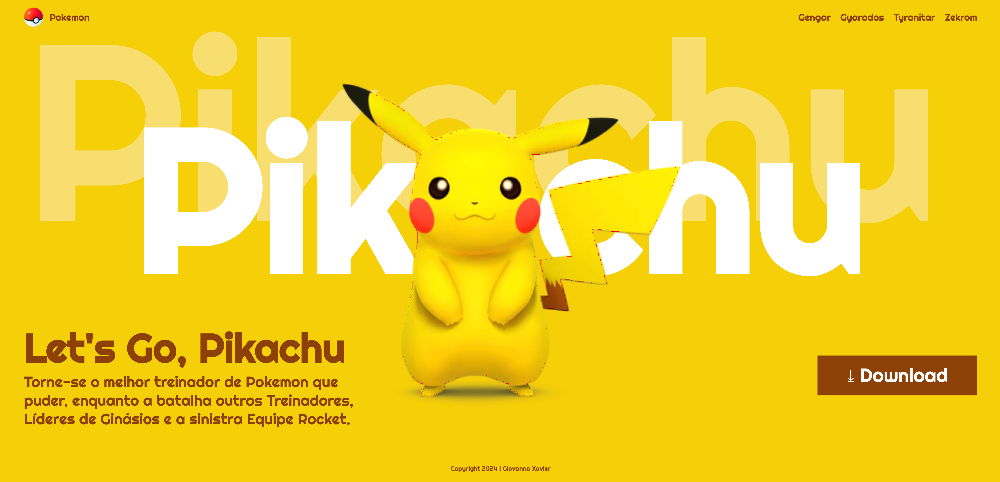

# Landind Page - Let's Go, Pikachu!

---
## Sobre
Site do tipo landing page para divulgar o jogo Let's Go, Pikachu.
O objetivo deste projeto é colocar em prática os conhecimentos adquiridos sobre as linguagens de marcação , HTML, CSS e markdown, durante o curso Técnico em Desenvolvimento de Sistemas do [SENAI Jandira](https://sp.senai.br/unidade/jandira/).

---

## Tecnologias utilizadas
- HTML
- CSS
- Markdown
- Git

---

## Autor

- [Giovanna Xavier](https://www.linkedin.com/in/giovanna-xavier-978538241/)